# Manual de Utilização
Toda a interação do usuário com o programa se dá através do menu superior. Nele, se encontram as ferramentas relacionadas às diversas operações existentes. Em ordem, da esquerda para a direita, se encontram as opções: carregar imagem, filtros passa-alta, filtros passa-baixa, filtros morfológicos, interpolação, histogramas e salvar imagem.

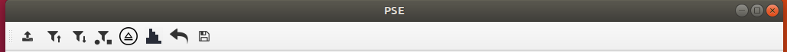

Ao clicar na primeira opção, abre-se uma janela para que o usuário possa navegar por seus diretórios e escolher a imagem desejada. Após selecionar, clicando em “abrir”, a imagem é carregada e o usuário pode ver o histórico de operações aplicadas na tela (inicialmente, apenas a imagem original replicada).

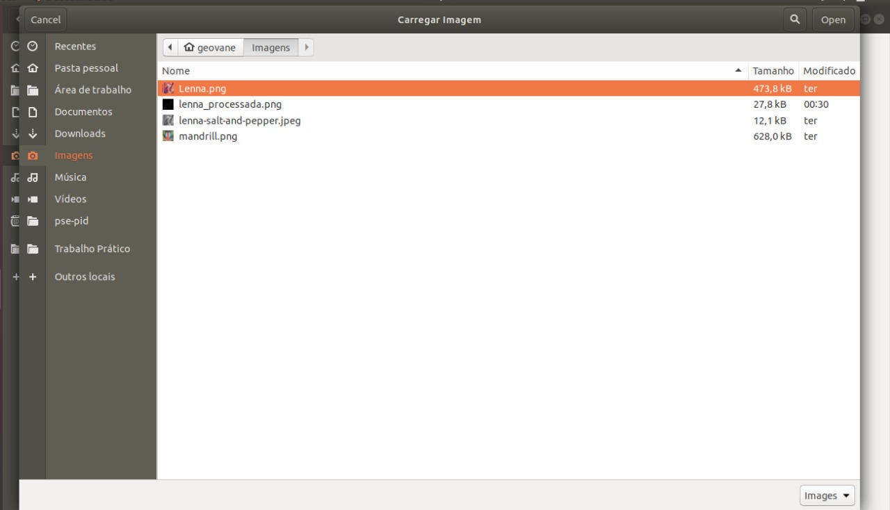  
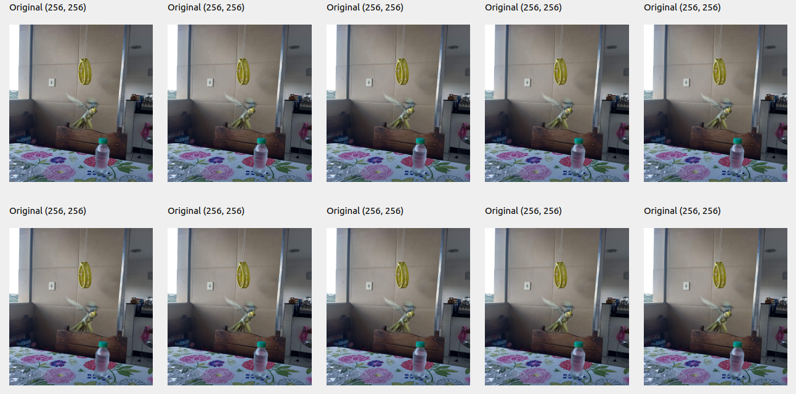

A medida que o usuário decide operar sobre a imagem, as novas imagens processadas vão sendo posicionadas sempre um quadro à direita da anterior. Caso todos os quadros ainda não tenham sido ocupados com imagens diferentes, a última imagem processada é replicada para os mais a direita. Após a utilização de novos filtros, quando todos os quadros já foram ocupados, os anteriores são retirados para que se tenha espaço para a nova imagem processada (ficando sempre no quadro mais à direita que, nesse caso, é o último).  

A segunda ferramenta é a dos filtros passa-alta. Ao clicar, uma nova janela é aberta, mostrando ao usuário as opções de filtros existentes. Ele deve escolher entre uma das opções, clicando no botão mais a direita de cada filtro, além de informar os devidos parâmetros (quando necessários). Após isso, basta confirmar a operação.  

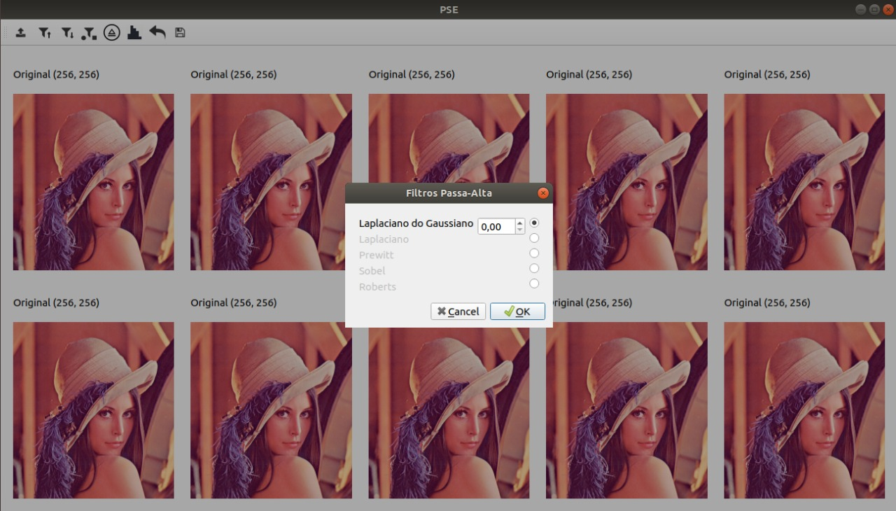
  
O terceiro e o quarto item dizem respeito aos filtros passa-baixa e morfológicos, respectivamente, e seguem a mesma ideia do anterior.

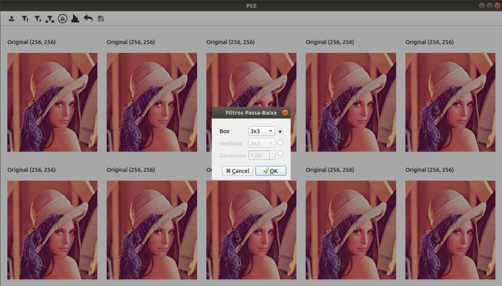  
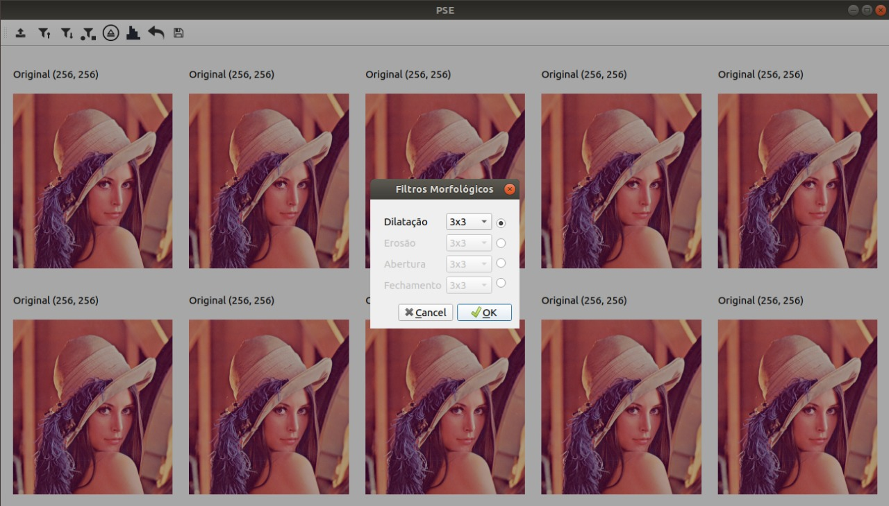
  
Ao clicar na quarta opção, uma caixa de diálogo é aberta para definir os parâmetros para realizar a interpolação da imagem. Um dos parâmetros é relativo ao tipo de interpolação que será aplicada na imagem, sendo que as opções são: Interpolação por vizinho mais próximo, interpolação bilinear e interpolação bicúbica. Já o outro parâmetro disponível é em relação a nova proporção da imagem, sendo possível diminuir ou aumentar a quantidade de pixels.

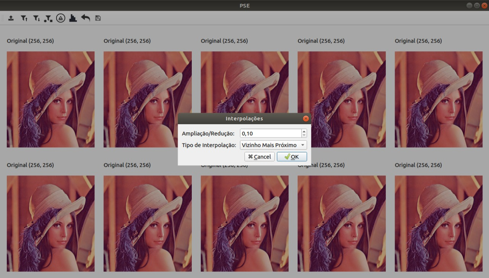

Na quinta opção, uma janela com dois histogramas é visualizada, sendo estes referentes a imagem original e a última imagem processada, respectivamente. São disponibilizadas 4 opções de histograma. O primeiro diz respeito aos tons de cinza da imagem, enquanto os três últimos são referentes ao sistema RGB.

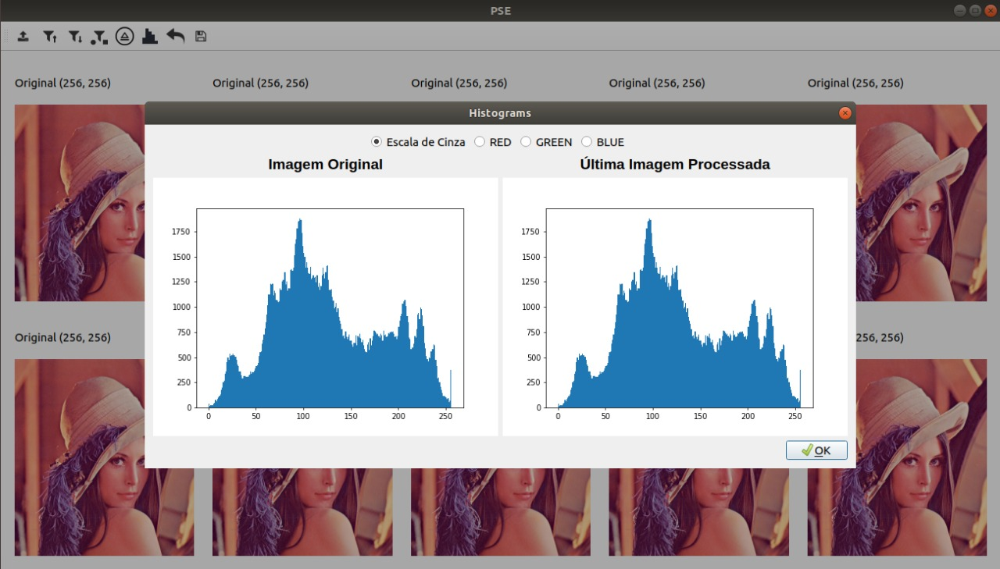  
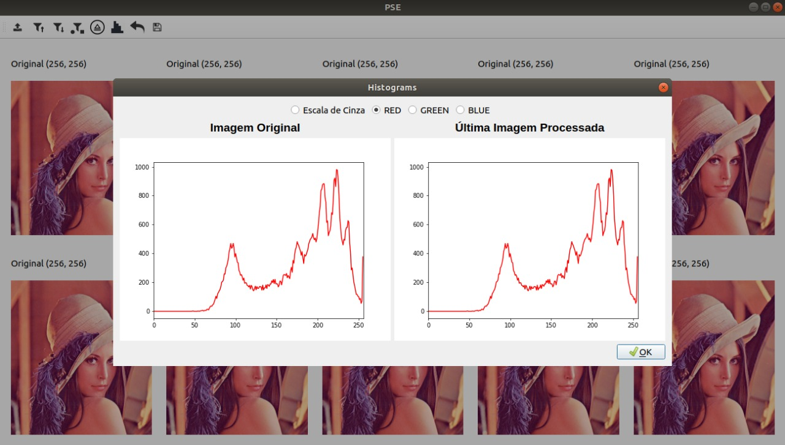  
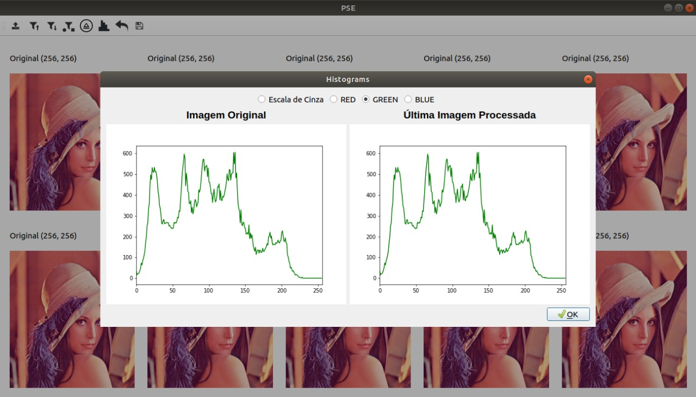  
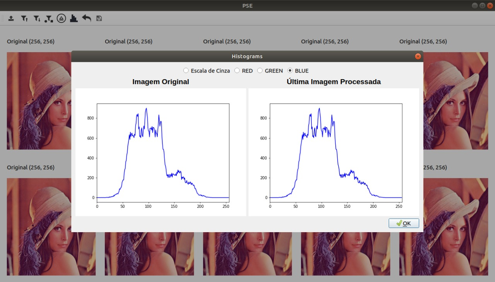

Por fim, a última opção permite ao usuário salvar a última imagem processada (mais à direita no histórico).

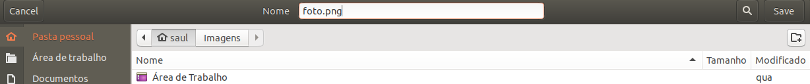
  
