# PSE - Image

## Introdução
Problem Solving Environment (PSE)  é um software de computador completo, integrado e especializado 
para resolver uma classe de problemas, combinando métodos automatizados de solução de problemas com 
ferramentas orientadas para humanos, para instruir na resolução de problemas. Um PSE também pode ajudar 
os usuários na formulação de resolução de problemas, na seleção de algoritmos, simulação de valores numéricos 
e na visualização e análise de resultados.  

Este Problem Solving Environment (PSE), possui como proposta a implementação de um software utilizando a 
terceira versão da linguagem de programação python. Tem-se o objetivo de demonstrar, através de uma interface 
amigável e pelo uso do conceito de fluxo de dados, a aplicação de variados processos envolvendo o processamento 
de imagens, podendo este ser definido como "qualquer forma de processamento de dados que apresentam entradas e 
saídas no formato de imagens“. 

Para esse trabalho foram implementados a interpolação pelo vizinho mais próximo, plotagem de histogramas, e 
filtros passa-baixa, passa-alta e morfológicos, com o uso de máscaras de convolução nos formatos (3x3. 5x5, 7x7. 
9x9, 11x11). No total, foram implementados na primeira versão do programa 12 filtros, sendo 3 deles passa-baixa (média
mediana e gaussiano), 4 passa-alta (laplaciano, laplaciano do gaussiano, prewitt, roberts e sobel) e 4 morfológicos
(erosão e dilatação, bem como abertura e fechamento).

## Conceitos Aplicados
A seguir esclarecemos os principais conceitos implementados.

### Interpoladores
Permitem um aumento artificial da resolução das imagens, ao adicionar pixels de cores intermediárias entre 
os já existentes. Com isto é possível evitar que os pixels da imagem “estourem” ao ampliar/esticar uma imagem 
de baixa resolução entretanto este processo não aumenta o detalhamento das imagens.

#### Interpolador Vizinho Mais Próximo
A Interpolação pelo vizinho mais próximo é um método de interpolação determinista no qual o valor estimado é sempre 
igual à sua amostra mais próxima não considerando qualquer outra. Dada a sua simplicidade, é regularmente utilizado 
para interpolações rápidas e em áreas de estudo bem amostradas. 

Para cada localização a ser interpolada deverá ser calculado a distância de todos os pontos amostrais a essa mesma 
localização e determinar qual deles terá a distância mínima sendo o valor correspondente a interpolação. Sendo (x0 , y0) 
as amostra é feita o cálculo da distância.
 
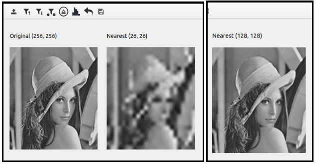  
*Parâmetro: Ampliação/Redução: 0.10 / 0.50*

#### Interpolador Bilinear
A Interpolação Bilinear é a extensão da interpolação linear para interpolar funções de duas variáveis em uma grade regular. Ela consiste na realização da interpolação linear, primeiro em uma direção, e depois novamente na outra direção.  
    
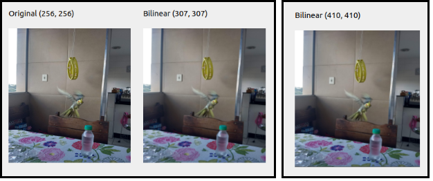  
*Parâmetro: Ampliação/Redução: 1.20 / 1.60*
    
#### Interpolador Bicúbico
A interpolação Bicúbica consiste na realização de uma interpolação envolvendo os 16 vizinhos mais próximos de um ponto, e normalmente garante uma melhor preservação dos detalhes finos, como as bordas, em comparação com outras técnicas.  

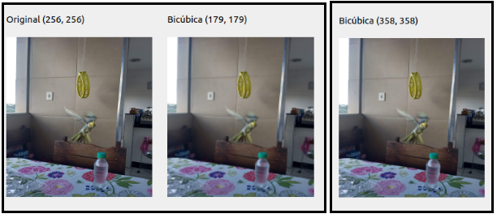  
*Parâmetro: Ampliação/Redução: 0.70 / 1.40*
     
### Histograma
Fornece a informação sobre quantos pixels na imagem possuem cada valor possível de intensidade (que, no caso das imagens de 
8 bits, variam de 0 a 255) ou, de forma equivalente, qual a proporção da imagem que corresponde a cada valor de intensidade. Os histogramas são também conhecidos como distribuição de intensidades e função de densidade de probabilidade (PDF).  

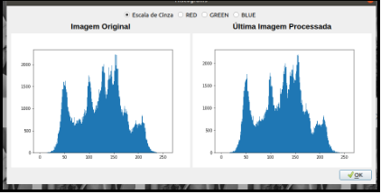  
*Histograma da imagem sem aplicação de processamentos*
    
### Filtros Passa-Baixa
Filtro passa-baixas é o nome comum dado a um circuito Eletrônico que permite a passagem de baixas frequências sem dificuldades e atenua (ou reduz) a amplitude das frequências maiores que a frequência de corte. A quantidade de atenuação para cada frequência varia de filtro para filtro.  

#### Box (Filtro de Média)
O filtro de média é um filtro linear de suavização que trabalha calculando diretamente o valor da média de uma área quadrada de pixels ao entorno do pixel desejado. Este filtro é usado para que se tenha a perda de nitidez da imagem em que está sendo aplicado. Ao aplicar o filtro de média, o valor de cada pixel analisado, terá seu valor alterado, pela média dos pixels que são vizinhos a estes.

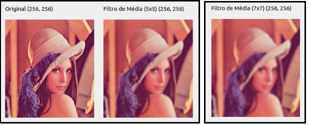
    
#### Mediana
O Filtro mediana é um filtro não linear de suavização muito utilizado para eliminar ruídos. E é definido como:

Onde R é uma sub-janela (normalmente uma região quadrada de 3x3 pixels).  

Para cada pixel da imagem, o operador mediana é executado em uma determinada região. Este operador não cria um valor diferente como resultado, este apenas trabalham com os valores da janela. Da seguinte maneira,o nível de cinza do pixel central é o nível de cinza intermediário do conjunto ordenado de níveis de cinza dentro da janela da máscara. 

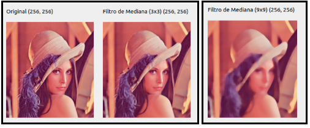

#### Gaussiano
Filtro Gaussiano é um operador não linear de convolução 2D (varredura de imagem por uma máscara), que é usado para suavizar as imagens e remover ruídos. Um conjunto de dados pode ter valores que se repetem, e a quantidade com que um valor se repete pode ser chamado de “frequência”. Um conjunto de valores pode ter frequências distribuídas de acordo com uma curva conhecida como “curva de Gauss”, ou curva “Normal”.

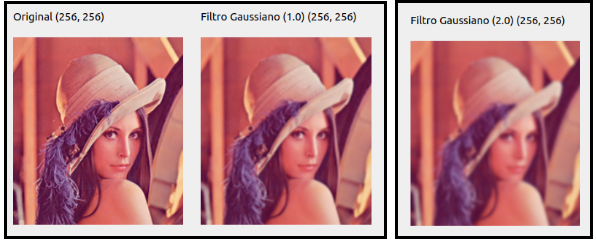

### Filtros Passa-Alta
FIltros de passa-alta ou de acentuação, têm como características eliminar baixas frequências, atenuar altas frequências, realçar o contraste e os detalhes em imagens além de destacar características como bordas, linhas, curvas e manchas. Nesse modelo de filtragem os componentes de alta frequência não são alterados, enquanto que os de baixa frequência são removidos fazendo com que os detalhes finos sejam enfatizados.

#### Laplaciano
O Laplaciano é um filtro que implementa uma derivada de segunda ordem da imagem, dessa forma detectando regiões de alta variação de cor, ou seja, bordas.

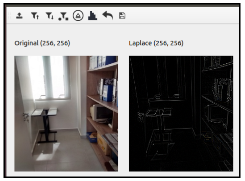

#### Laplaciano do Gaussiano
O filtro Laplaciano do Gaussiano, é uma combinação do filtro Laplaciano que é um filtro que implementa uma derivada de segunda ordem da imagem, dessa forma detectando regiões de alta variação de cor, ou seja, bordas. Geralmente o filtro Laplaciano é aplicado após passarmos um filtro suavizante, passa-baixa, para eliminarmos os ruídos neste caso o filtro Gaussiano já caracterizado anteriormente.

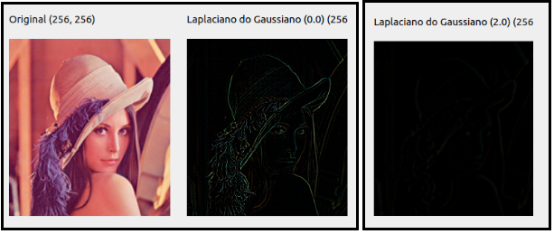  
*Parâmetros utilizados: 0.0 / 2.0*

#### Prewitt
O Filtro de Prewitt trata-se de um operador de diferença, computando uma aproximação do gradiente da função de intensificação da imagem. Onde em cada ponto da imagem, o resultado do filtro é o vetor gradiente correspondente, ou a norma do vetor.  

Baseia-se em realizar uma pequena e separável operação de convolução, nas direções vertical e horizontal separadamente, e portanto obtendo um custo computacional relativamente baixo.

  

#### Sobel
O filtro de Sobel é uma operação aplicada sobretudo em algoritmos de detecção de contornos. Consiste num operador que calcula diferenças finitas, dando uma aproximação do gradiente da intensidade dos pixels da imagem. Em cada ponto da imagem, o resultado da aplicação do filtro Sobel devolve o gradiente ou a norma deste vector.  

Efetua o cálculo do o gradiente da intensidade da imagem em cada ponto, dando a direcção da maior variação de claro para escuro e a quantidade de variação nessa direcção. Assim, obtém-se uma noção de como varia a luminosidade em cada ponto, de forma mais suave ou abrupta. Com isto consegue-se estimar a presença de uma transição claro-escuro e de qual a orientação desta. Como as variações claro-escuro intensas correspondem a fronteiras bem definidas entre objectos, consegue-se fazer a detecção de contornos.  

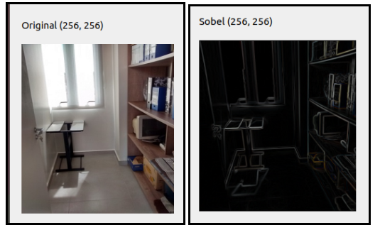  

#### Roberts
Esse filtro também serve para encontrar bordas ou contorno de regiões na imagem, mas utilizando uma máscara 2x2.

  
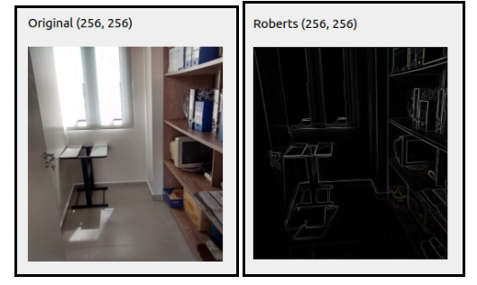

### Filtros Morfológicos
São filtros utilizados após o processo de segmentação da imagem, com o objetivo de remover imperfeições, e prover informações a respeito da forma e da estrutura da imagem. Fundamentalmente, técnicas de processamento morfológico de imagens são como técnicas de filtragem espacial, é escolhido um elemento estruturante(estrutura de matriz) e este é movimentado por cada pixel da imagem original para gerar um novo pixel na imagem processada.  

#### Dilatação
A transformação morfológica por dilatação combina dois conjuntos utilizando adição vetorial. A dilatação preenche buracos, lacunas podendo reparar instruções. O problema que aumenta o objeto da imagem.

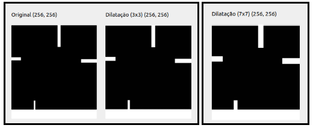

#### Erosão
A transformação morfológica de erosão é o oposto da dilatação, escolher o valor mínimo dos pixels sobrepostos do elemento estruturante na imagem. Combinando dois conjuntos utilizando subtração vetorial. Serve para separar objetos, podendo remover extrusões. O problema dele está em diminuir o tamanho do objeto.  

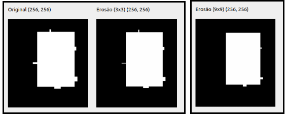

#### Abertura
A operação de abertura consiste na combinação primeira da aplicação da operação de erosão e depois da dilatação. A erosão serve para separar os objetos e a dilatação para recuperar parcialmente a forma original. Utilizada para remover ruídos do fundo, suavizar o contorno dos objetos. 

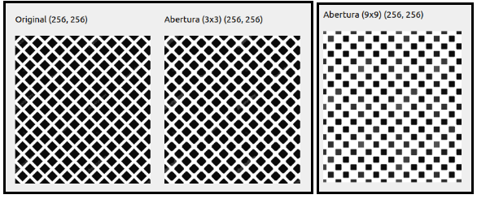

#### Fechamento
O oposto da abertura, combina primeiro a operação de dilatação e depois a erosão. Preenche vazios, junta objetos sem aumentar o tamanho deles e remover ruídos dentro do objeto.

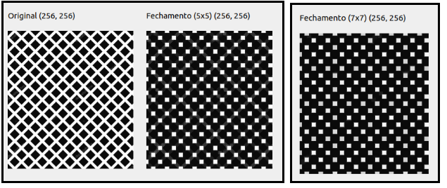

## Recursos Utilizados
O PSE foi desenvolvido na terceira versão da linguagem python, utilizando-se as seguintes bibliotecas:

* PyQt5 (Interface)
* Numpy
* Scipy
* Scikit-image
* OpenCV
* Matplotlib
* Pillow
* QImage2Array

## Considerações finais
O PSE construído pelo grupo conta com elementos básicos de interpolação, filtros de suavização, contraste, detecção de contornos, e morfológicos. É um sistema simples e intuitivo, em que um usuário comum não terá muita dificuldade de utilizar, podendo adicionar imagens e testar os filtros, inclusive filtros aplicados sobre filtros, em que o usuário pode acompanhar a imagem original e a final, além do fluxo dos filtros aplicados.  

Vale ressaltar que ainda há muito o que ser implementado no programa, como segmentação e detecção de bordas por exemplo. Apesar disso, o desenvolvimento atingiu um nível satisfatório. Sendo assim, quem quiser dar continuidade ao trabalho já desenvolvido e aprimorar o que já foi implementado até o momento, corrigindo os problemas, adicionando funcionalidades e até tendo a possibilidade de desenvolver novas aplicações, terá um material base para exercer essa tarefa.

## Desenvolvedores
Gabriel Luciano Gomes  
Geovane Fonseca de Souza Santos  
Luigi Domenico Cecchini Soares  
Saul Gustavo Caldeira Melo  
